# Write-At-Hand:  Creative Writing Prompter App

### Repository

[Github Repository ](https://https://github.com/anna-cee/t3a2-part-a)

### Trello

[Trello Board ](https://https://trello.com/b/FUjSHdsI/react-app-part-a-writing-prompter)

## R1 	Description of your website, including:

### Scope

### Purpose

#### Outlining the problem
Problem:
Writers of many kinds use pen and paper notebooks, which are highly portable, to jot ideas, make entries and do short activities in any writing environment they choose, but they then have the problem of storing or retrieving those ideas IF they choose to re-use them or develop them at another time. Furthermore, writers often use prompt ideas to mix up their practice but it can be cumbersome to cart these around with their notebooks.

Solution: Use a creative writing app.

Problem: There are a bunch of apps that don't provide this. 

#### The creative writing app landscape

There are a lot of creative writing apps around, each falling into roughly three groups. Firstly, there is general writing software that provides word and document processing and is often searchable e.g. simply Notes on iOS, or those also embedded within goal/project oriented features e.g. Notion.
Then there are apps that are specifically for creative writing but provide highly scaffolded steps, and even courses, to support a writer towards and through a larger project like a manuscript/screenplay e.g. Scrivener, Werdsmith, Writerly etc. Finally, there are short prompting apps e.g. brainsparker, wordpalette, dailyPrompt, and jumpwrite. 

Each prompting app has a different solution for providing the prompt content. Brainsparker has very general brainstorming flashcards with no text editor for input and the card content is only sometimes applicable to creative writing. Word palette allows a user to define their preferred text and content types then generate a random word salad extracted from that textual tone, then input their own response. DailyPrompt is interactive and allows users to make a social profile and write their own prompt activities for all to use, according to category. 

Jumpwrite has the most similar solution to the scope of this app, with a random word generator prompt, a random image generator prompt from APIs, however it has no backend for users to save their input.

### 

Solution: This app. This is a creative writing app that is simple, direct, distraction-free, has a prompt option, and allows the writer to save and search their entries. The aim is an app that has the portability and simplicity of a notebook and pen in your jacket pocket, but the storage capacity of your home bookshelf, searchability of your laptop and convenience and stimulation of an in-built activity prompter. 

Creative writers tend to complete short exercises out and about, changing location or choosing a favourtite cafe, writing in notebook after notebook. This can make it hard to find and reuse ideas, character profiles, prose snippets that might be reused in a larger structures piece.

### Functionality / features

SignUp & LogIn
- A user will be able to sign up to the app using an email address and password.
- A user will be able to log in  and use this login to save entries and search for saved entries.

Menu
- A user will be able to choose to make a straight entry, or choose from a prompt or range or prompts.

Text Editor
- A user will be able to write an entry using a text editor.
- It will use jodit-react as a text editor
- a user can make an entry without using a prompt

Prompt Generator
- A user will be able to generate a random prompt and respond to it.
- it will use random-words npm package to generate phrases
- user can refresh the prompt if they're not happy with the prompt they got.

Save Button- Saving Entries 
- A user will be able to save an entry.

Identifying data for entries: Title Bar, Tags Bar 
- A user will be able to add identifying data to their entry to make it searchable e.g. title and tags.

Search Bar (Retrieving Entries)
- A user can find past entries using a search bar and enter identifying data e.g. titles and tags. The user can add the date as a title.

Collections
- A user will be able to create groups of previous entries organised according to a tag or title they've chosen.

View Entry
- A user will be able to view a past entry by finding it in the search bar or a colletion

Edit Entry
- A user will be able to make text changes and update and save that entry

Promp Bank
- A user will be able to create and save their own prompts
- A user will be able to use these as random prompts

### Target audience

The target audience is primarily existing writers who are already creative writers professionally or as a hobby, or who write in some other form and want a creative writing addition. 
Still, the app can easily be used by anyone who wants to write to a prompt or make saveable entries, but it doesn't provide a lot of training or support for those looking for a course.
The app could be used by writers of any age, although depending on the prompt, maybe 14 or 15+, with no upper age limit. 
The app can be used by writers of diverse backgrounds and who write in any form, although prompts are in English in this iteration.

### Tech stack 	

MERN. (Mongo, ExpressJS, React, NodeJS)

***Front End***
- JavaScript
- React + React Library
- HTML/CSS
- Packages: npm package manager

***Back End***
- ExpressJS
- NodeJS
- hosting: render

***Database***
- MongoDB
- (NodeJS)
- Mongoose 

***Hosting & Deployment***
- netlify
- render
- MongoAtlas

***Testing***
- Jest

***DevOps***
- Github
- VSCode

***Project Management***
- Trello
- (Kanban)

***Design Tools***
- Balsamiq (wireframes)
- draw.io (diagramming)

## R2 	Dataflow Diagram 	

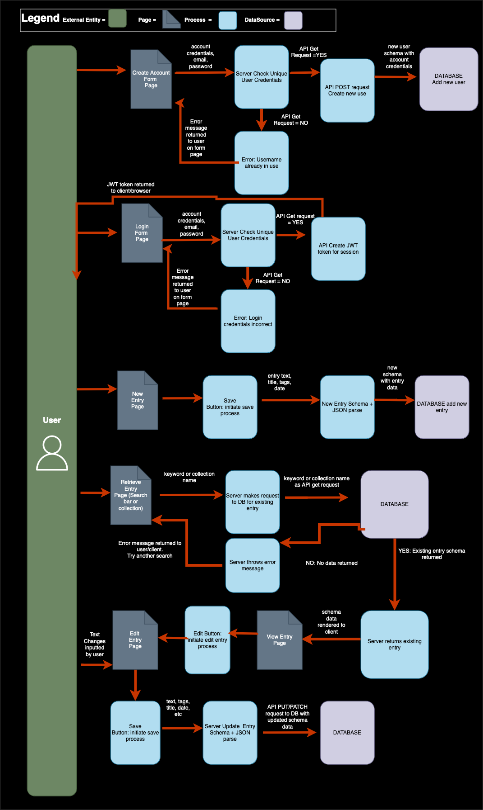

## R3 	Application Architecture Diagram 	

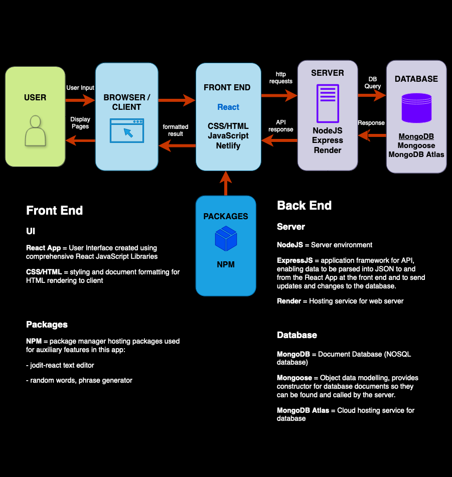

## R4 	User Stories 	

### User Profile # 1
### Penny Jotterman: the hobby creative writer. 

- Penny writes creatively for enjoyment and writes comfortably and regularly. 
- She's not looking for her inner creative to be unlocked by a course, but she does use activities and tools as she prefers as part of her own practice. 
- What she writes is diverse: sometimes she works on structured or competition pieces, sometimes she writes brief ideas, scenes, character sketches or responses to activities. 
- Where she writes also varies, sometimes at home, sometimes out at a cafe or a park or when travelling. The environment she writes in could be chosen to be conducive to writing or the place itself may provide material to respond to.
- She uses either a pen & paper notebook, or a tablet or a laptop to write depending on where she is and what she's writing.

Penny's needs:

- I want to be able to use an app like a notebook, so it's portable and I can just open it and start writing.

- I want an app that lets me write without distractions - no socials, no massive selection of ideas that could be overwhelming, no ads.

- I want an app that doesn't guilt me about my writing - I don't want any tracking or recording of how regularly I write. I already have a writing practice I don't want an app that puts an expectation on me.

- I want to be able to save what I write if I want. Sometimes I might just write junk and don't keep it, other times a great idea or character might come that I want to keep for later.

- I want to be able to find the entries I save again easily.

- I want to have the option to find and open a past entry and then write more on it and keep it so I can flesh out/ develop ideas in the app.

- I want the option to respond to a prompt, but I also want to be free to not use it.

- I'd like to be able to choose different types of prompts within limited, not overwhelming, choice, like writing a scene vs responding to a prompt.

### Revision

- I'd like to be able to save my own prompts so I can use them or the prompt generator in the app. 
- I'd like to be able to refresh the prompt generator if I don't like the prompt I get or I try it and the writing just isn't flowing.

### User Profile # 2
### Manu Scripsson: the professional (creative) writer

- Manu is a creative writing professional.

- He works across the cycle of a work, from ideas development to drafting and editing.

- What he writes professionally is mostly fictional prose but he does some script editing work and feature writing.

- Manu keeps a regular flow of ideas in his artistic practice, which may or may not become finished works or be integrated into other ideas.

- Part of his artistic practice is to do short writing activities that might be ideas that appear to his mind that he wants to explore or responses to prompts or his environment.

- Manu prefers to do these activities outside of the home or the workplace so that he's separated from family and work life and any routine thinking that comes with it.

- Manu mostly uses his phone or a notebook(paper) for this kind of writing, so he can fit in to diverse environments.

Manu's needs:

- I want a writing app that doesn't assume I'm not a writer. Please no courses or promises of how great my first novel will be.

- I want a writing app that isn't like my work. I already use forms and programs at work that chart scenes and chapters and plotlines etx. 

- I want an app that lets me just write in it like a notebook. 

- I want my entries to be savable so I can keep them if I want.

- I want to be able to find ideas again and develop them.

- I want to have the option of some in-built prompt or stimulator in case I dont' have anything in mind. 

- I want to be able to build out characters in a profile. So I'd be able to profile their basic information, but then also be free to write an entry related to them, so a scene or a plot point etc. I don't want it to be too ridid a form, I want some free writing included.

- I want the app to be private. I'm not saying my next idea is going to be the greatest film of all time therefore it needs hiding - but, in case it is, I'd like it to be private and not on a public wall.

- I want an app that is not collaborative or social. I collaborate and connect with other writers and editors a lot in my real life work. For me, it's just a distraction for this type of app.

- I'd like to be able to share the text. Even though I'm not looking for a social platform, it would be handy to be able to share the text from entries with others in some way, whether it's as a text message, email, airdrop or on a social media platform, so if I want to use it for work or share an idea or something, I can do that easily.

Revision
- Although I don't want it to be too much like my work writing programs, I would like to be able to write characters and scenes and save them.

### User Profile # 3
### Paige Turner: journal-keeper who wants to write creatively

- Paige has a regular journal writing practice but doesn't write much creatively.

- Paige wants to do some creative writing but isn't sure about taking on a whole course or a large project.

- Paige has a regular day job and writes in snatches of time she finds in her day.

- Paige often writes at home on her laptop, so her journal is all in the one place but sometimes writes on the go.

Paige's needs:

- I want a creative writing app that I can also use a journal - is that a thing? Or, a journal that I can use as a creative writing app.

- I want to be able to make an entry and save it under a date, so I can keep it as a journal entry.

- I want to be able to find entries according to date again.

- I want to be able to make an entry that isn't part of the journal too. 

- I want to be able to keep my journal entries private, just like saving it on my harddrive. 

- I want to be able to access the app on more devices than my laptop so I can do journal writing or creative writing in the same online place, but be in more physical places without having to carry my laptop around.

- I want to have help getting going with creative writing, so a prompt please!

- Because I'm new to creative writing, diverse prompts would be good to try out, but nothing too heavy, I still have my journal to keep.

Revision
- It would be cool if the writing page had a timer in it so that I could do a timed writing. Then I wouldn't get too bogged down or frustrated. I can use my own timer, but it would be handy having it on the page.

## R5 	Wireframes for multiple standard screen sizes, created using industry standard software 	

### Landing Page

The starting page takes the user straight to writing with or without a log in. Nav bar with Signup link.

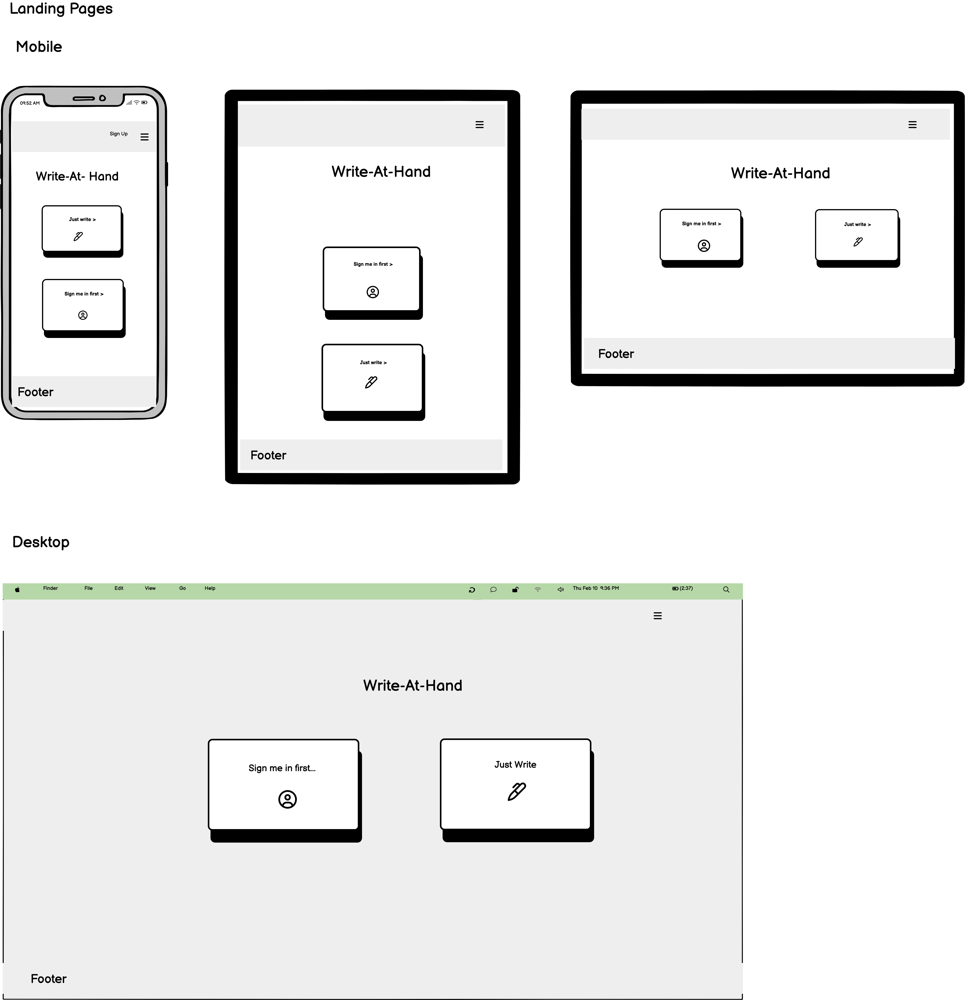

### "Just Write Page"
With no log in, the user writes stright away.
Text editor displays and the option to call a prompt or update it is there. 
A save button for change of mind to sign in is added.

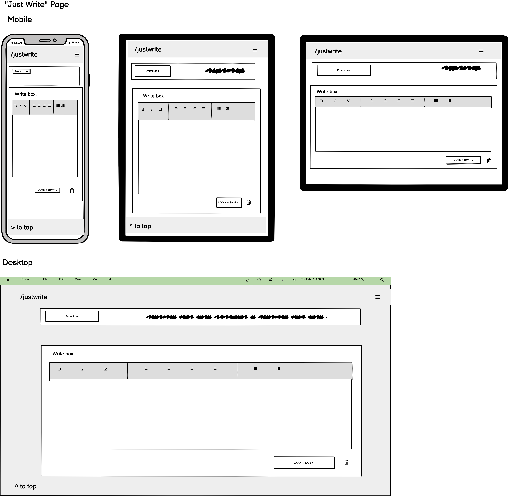

### Sign In Page

User login with "forgot password" option
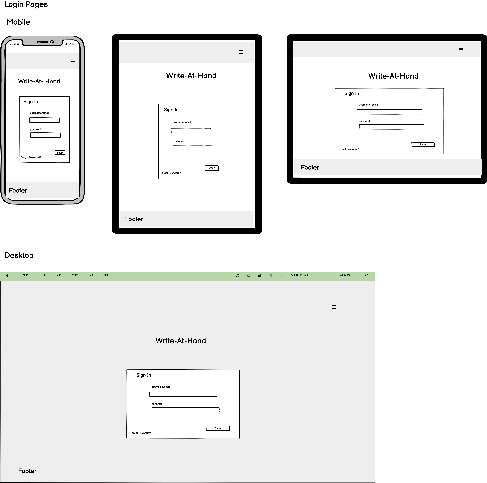

### User Home Page

3 cards lay out 3 options on the user homepage. Firstly, buttons to the text editor page to make an entry with or without a prompt. Secondly , writer can add own prompt which are displayed in the card below the tet input. Past writing can be searched with the search bar. Assigned collections are displayed and can be opened. Both last two options lead to follow search results/collections list page.

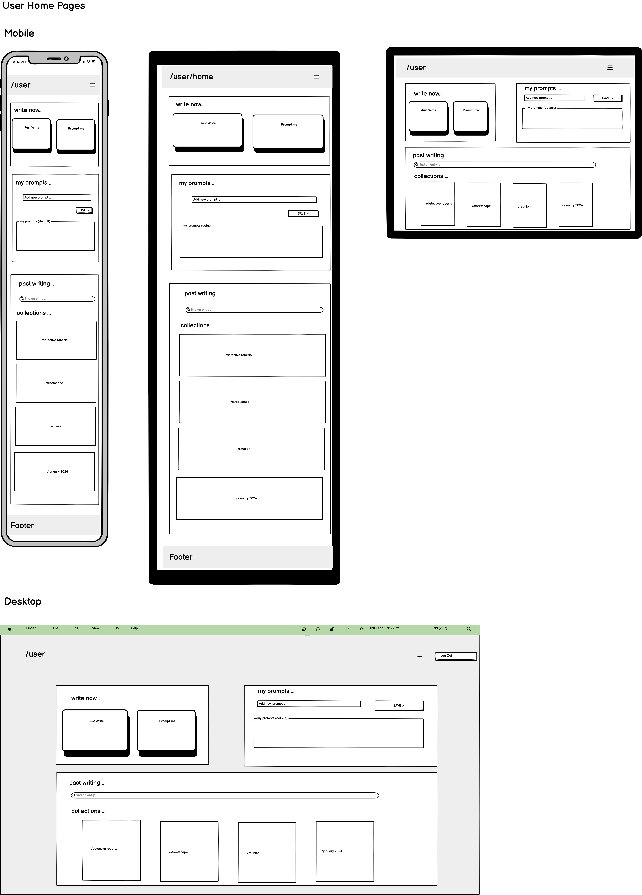

### User Entry Page

The user entry page is the same as the "just write" page with a save option and text input bars to include identifying labels with the saved entry.

Prompt button persists so the writer can get a prompt if they change their mind after just writing, or get a new prompt if the one they get isnt' working for them.

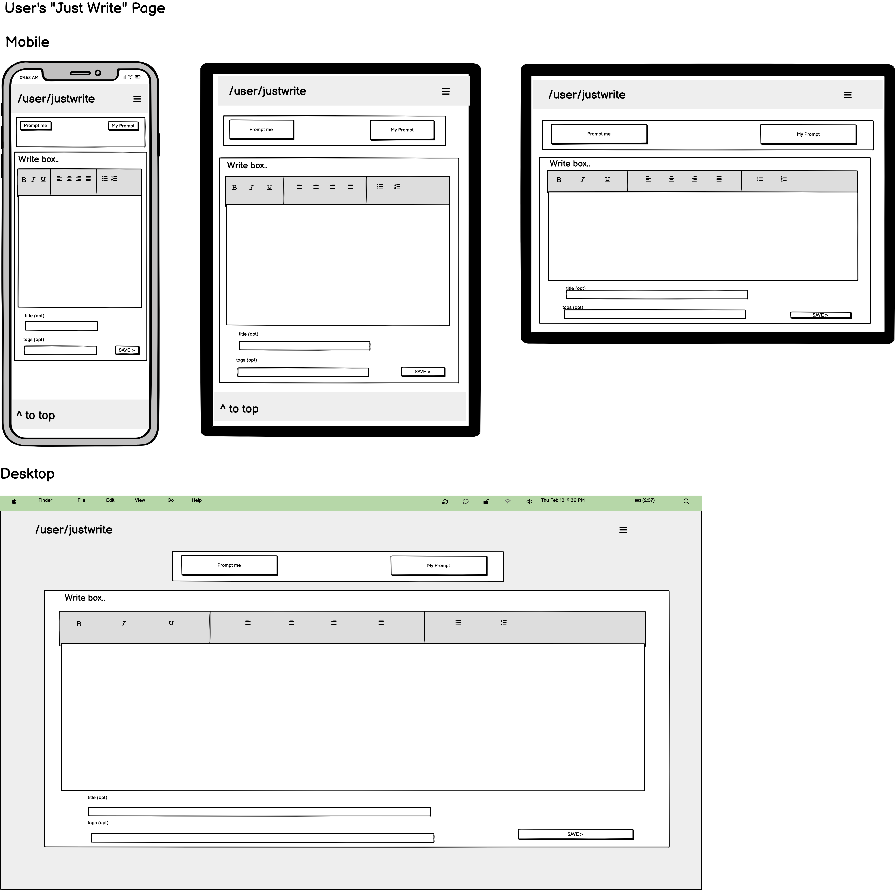

### Search Result or Collection List Page

Card with search term title and list of entries with link for serach or colletion results. Each result includes the first line ( in case there is no title) as well as title and date data. Clicking a linke leads to view entry page

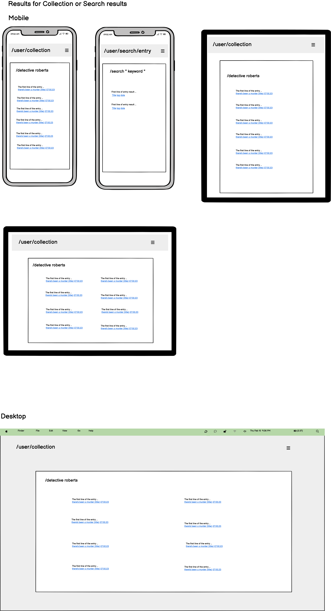

### View Entry Page

the collection title or search term is used as a title, followed by the entry title, then full entry text in paragraph form.

Edit Button if user wishes to edit leads to Edit entry page.
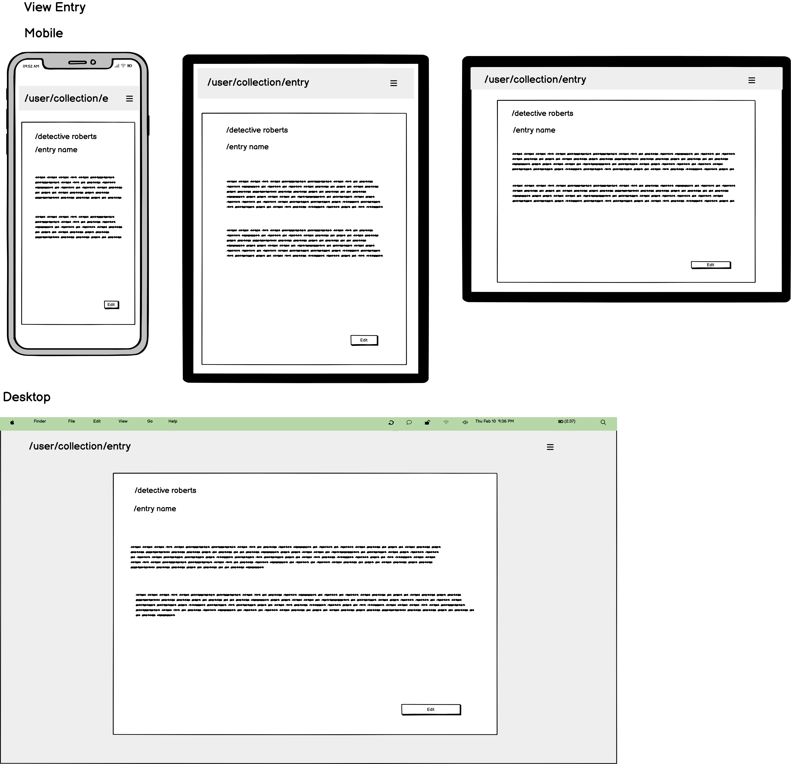

### Edit Entry Page

Text editor shows with selecgted entry text. Save Changes Button.
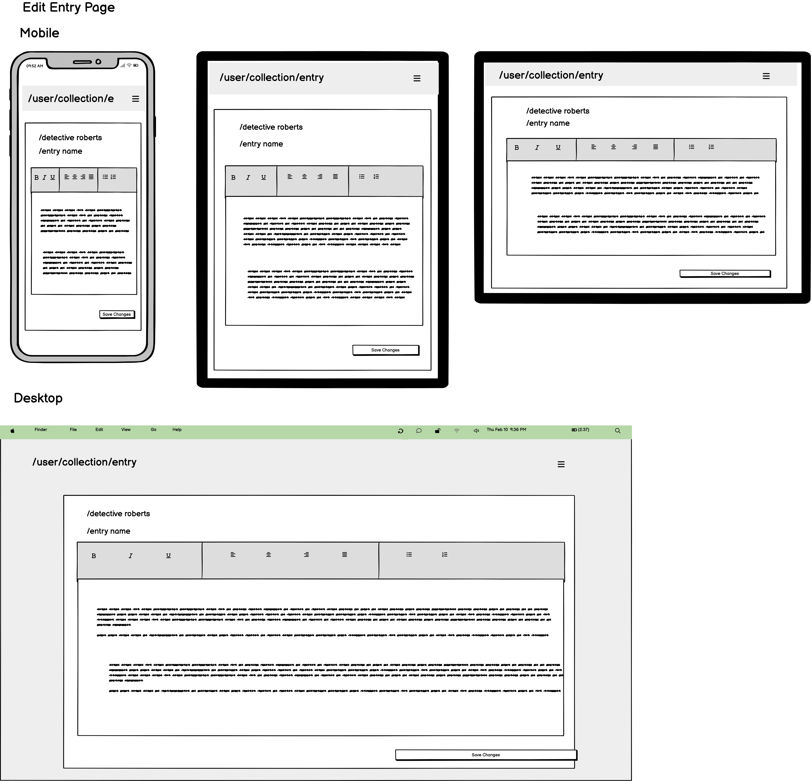

### User Home - Extended

If it's possible to go beyond the MVP for this project, two more prompt buttons added to the User Home Page: Scene and Character. These lead to the following Character and Scene Entry pages.

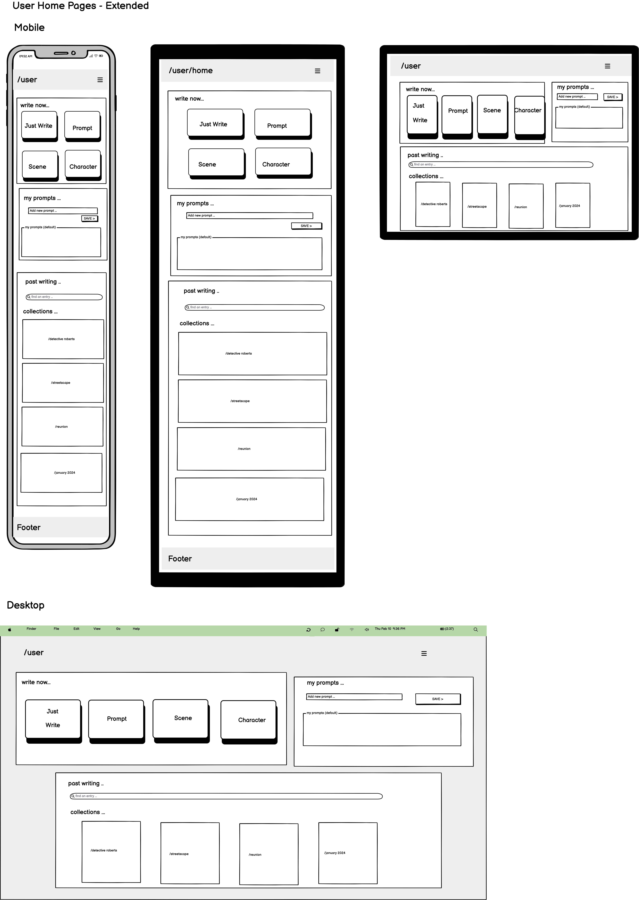

### Character Entry Page

Text input field for character profile information.
Free text editor for entry related to character. Saves under character profile.
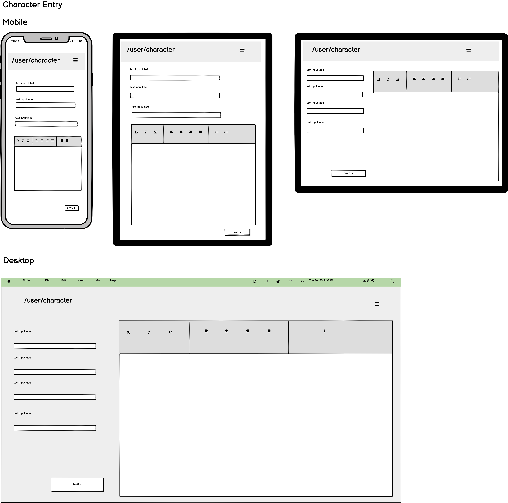

### Scene Entry Page

Film scene image displayed as prompt for writing a story scene. Option to get a new prompt. Option to save entry.

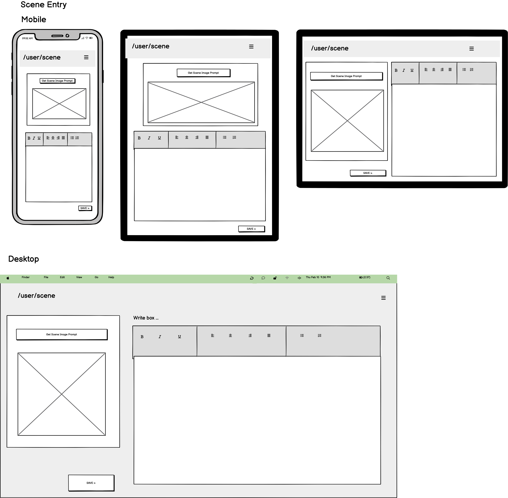

## R6 	Screenshots of your Trello board throughout the duration of the project 	